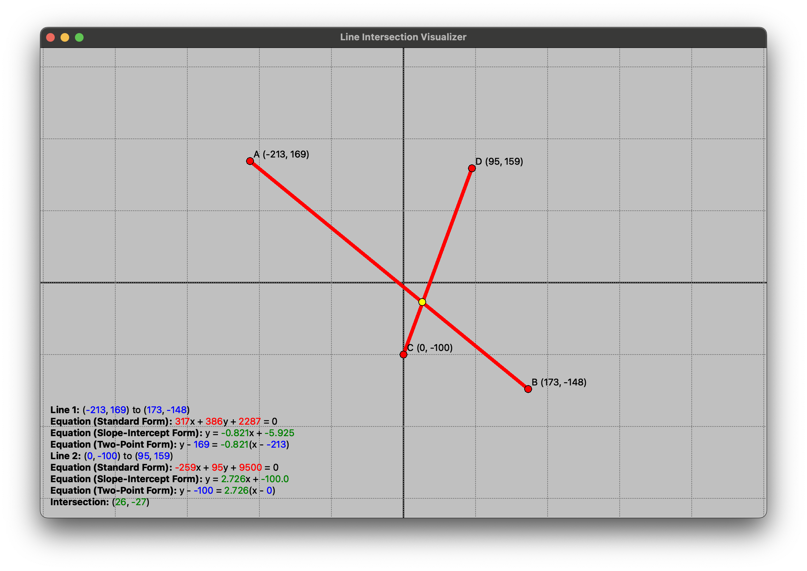

# shapes

Nix environment for working with shapes.

## Line Intersection Visualizer

Simple demonstration application showing the calculation of the point of intersection of two line segments.



```bash
nix run
```

## Development environment 

Development environment is provided using Nix and UV.

To enter the development environment run:

```bash
nix develop
```

And to run the script:

```bash
uv run main.py
```


